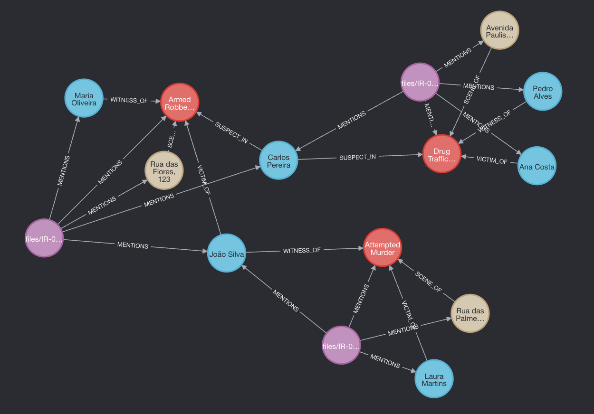

# Knowledge Graph RAG with Local LLM

This is an **<*ongoing*>** personal project aimed to practice building a pipeline to feed a Neo4J database from PDFs containing (fictional) crime reports. It uses a local LLM instanciated with Ollama to extract entities and relationships from the text. The pipeline is built with LangChain.

It is based on [Neo4J - Enhancing the Accuracy of RAG Applications With Knowledge Graphs](https://neo4j.com/developer-blog/enhance-rag-knowledge-graph/?mkt_tok=NzEwLVJSQy0zMzUAAAGTBn-WDr1KcupEPExYL6rh_DaP3R0h5gWQFxWGRm6dXiew5-oAnYBbvXvedknjyhyojNebyUa0ywWZwIkZQRtiJ-9x6k22vY3ru2Ztp7PjlgN5Bbs) article, adapted to use a local LLM instead of the OpenAI API.

To run this project you'll need:
1) [Docker](https://www.docker.com/) installed and running on your machine (docker-compose.yml file included in the repository).
2) [Ollama](https://ollama.com/) installed and running on your machine, and a [model](https://ollama.com/library) downloaded.
3) A Python environment with the required packages installed. You can install them with `pip install -r requirements.txt`.
4) A .env file with the following variables:
```
NEO4J_URI=bolt://localhost:7687
```

After running the pipeline script, check out the Neo4J database at `http://localhost:7474/browser/`:
```
MATCH (n)-[r]->(m)
RETURN n, r, m
```

You should see all the entities and relationships extracted from the PDFs.




> The Graph RAG is not implemented yet...


> *Stack:* Python, LangChain, Ollama, Neo4J, Docker
